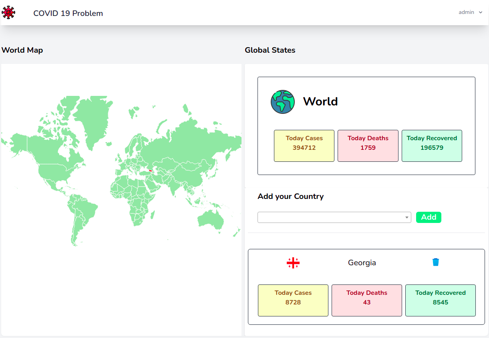

## Table of Contents

*  [ About The App](#about)
*  [ Install and Run](#iar)
*  [ Resources](#resources)

## About app
    Covid 19 is an app where you can see the number of people infected with Covid, recovered and deceased worldwide You can also get and save country-specific statistics in your account

## App looks like 

## Install and run

1.  Download ZIP or Clone git repository
2.  Run the command `composer i`
3.  Run the command `npm i`
4.  Run the command `npm run dev or npm run watch`
5.  Configure the database in the `.env ` file
6.  Run the command `php artisan key:generate`
7.  Run the command `php artisan serve`

## Resurces
*  [ API ](https://disease.sh/)
